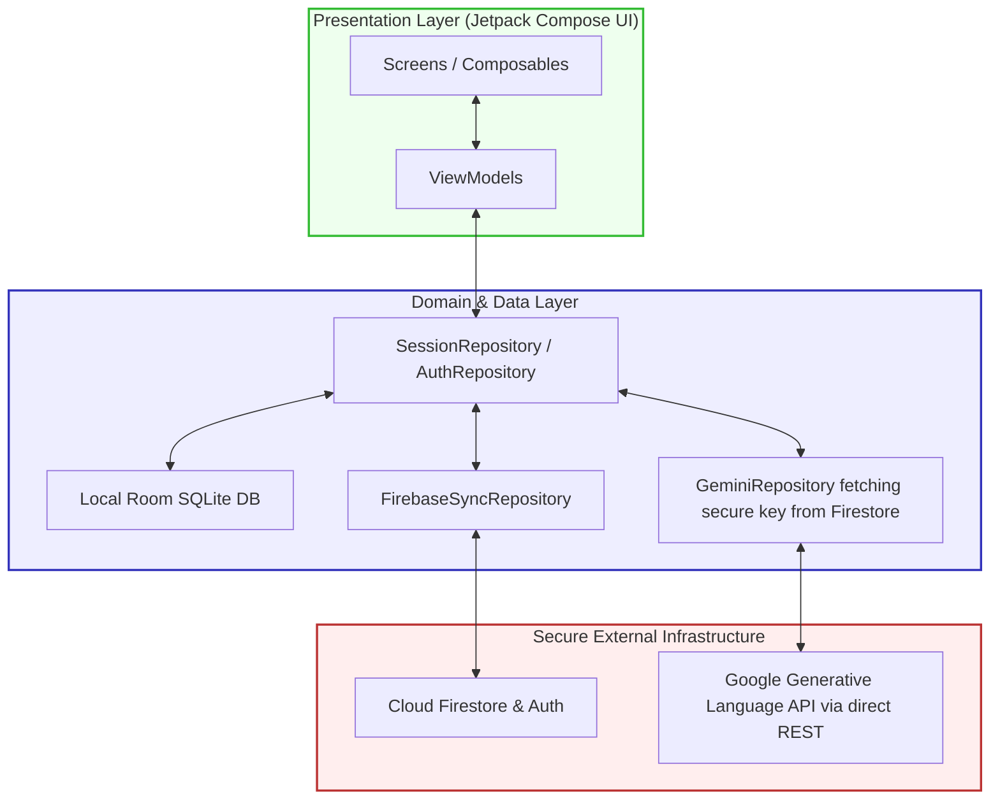

# 📝 AI Notes Generator (AInotes)

[](https://kotlinlang.org)
[](https://developer.android.com/jetpack/compose)
[](https://firebase.google.com/)
[](https://developer.android.com/training/data-storage/room)
[](https://developer.android.com/topic/architecture)

An ultra-premium, high-fidelity Android application designed to elevate the study experience. Built entirely in **Jetpack Compose** and **Kotlin**, AInotes leverages local **Google ML Kit OCR**, raw **PDF text extraction**, and a secure **Firebase Firestore dynamic API key delivery system** to transform documents, images, and handwritten notes into comprehensive study guides (summarized key points, formulas, interactive 3D flashcards, and practice exam questions).

Unlike generic AI apps that force users to register their own API keys, **AInotes operates like a real-world production application**. The Gemini API key is stored securely inside your Firebase Firestore database—never embedded inside the APK or visible to clients. The app dynamically fetches the key on generation and uses it directly. Users simply open the app, authenticate with Google, and begin generating notes instantly.

---

## 📖 Table of Contents
1. [🎨 Premium UI/UX & Visual Preview](#-premium-uiux--visual-preview)
2. [✨ Key Features](#-key-features)
3. [🛡️ Secure Server-Side Firestore Architecture](#%EF%B8%8F-secure-server-side-firestore-architecture)
4. [🤖 AI Model Fallback Chain](#-ai-model-fallback-chain)
5. [⚙️ System Architecture Diagram](#%EF%B8%8F-system-architecture-diagram)
6. [📁 Codebase Directory Structure](#-codebase-directory-structure)
7. [🛠️ Developer Setup & Deployment](#%EF%B8%8F-developer-setup--deployment)
8. [🔐 Data Model & Local Schema](#-data-model--local-schema)
9. [🤝 Contribution Guidelines](#-contribution-guidelines)

---

## 🎨 Premium UI/UX & Visual Preview

AInotes is engineered with **state-of-the-art mobile UI aesthetics** featuring a harmonized **Violet & Indigo** visual theme, smooth canvas rendering, glassmorphism elements, and glowing gradients.

### 📱 Screenshots & Visual Walkthrough

| 🚀 1. Onboarding Screen | 🏠 2. Time-Aware Dashboard | ✏️ 3. Create Note Screen |
| :---: | :---: | :---: |
|  |  |  |

| 🤖 4. AI Orbit Loader | 📚 5. My Notes Library |
| :---: | :---: |
|  |  |

### 🎨 Design Highlights:
*   **Premium Theme Palette:** Built on a customized violet primary (`#6C5CE7`), deep indigo highlights, soft lavender card containers (`#F7F6FF`), and teal accents (`#00B894`).
*   **Time-Aware Dashboard:** Greets users dynamically based on time of day (e.g. *"Good evening, Anurag! 👋"*), displaying first-name extractions from Cloud Firestore alongside custom circular initial avatars.
*   **Interactive Orbit Loader:** When processing notes, users are presented with a gorgeous animated robot with canvas-drawn orbiting rings utilizing sweep gradients, floating particles, and a glowing linear loader tracking progress.
*   **Textbook-Style Formula Blocks:** Displays chemistry, physical, and mathematical equations inside premium green-bordered formula boxes matching real academic textbooks.
*   **Visual File Upload Panel:** Spacious upload zone that renders custom status changes—including glowing state badges that transition into interactive checkmarks once a document is successfully loaded.
*   **Interactive Study View:** Includes 3D flashcards with smooth 180-degree flip animations, toggleable bookmarks, clipboard sharing, and text downloads.

---

## ✨ Key Features

*   **Multi-Format Document Ingestion:** Ingests PDFs, printed images, handwritten notes, and plain text.
*   **Local On-Device OCR:** Employs **Google ML Kit Text Recognition** for instant, secure local OCR processing of physical notes, documents, and screenshots.
*   **Chunked PDF Processing:** Seamlessly processes documents of unlimited length by smart page-chunking via `PdfBox-Android` to dodge token and gateway constraints.
*   **Comprehensive Study Modes:** Generates 5 distinct content types:
    *   `Study Notes / Key Points` with expandable rich-media topic cards.
    *   `Formulae & Scientific Laws` with explanation blocks.
    *   `3D Flashcards` with smooth, touch-activated flip transitions.
    *   `Exam Preparation` featuring MCQs, short answers, and detailed model responses.
    *   `Custom Prompts` allowing custom analytical queries on top of documents.
*   **Persistent Offline-First Cache:** Stores generated notes inside local SQLite DBs using **Room Persistence Library**, ensuring complete offline availability.
*   **Instant Cloud Synchronization:** Integrates **Firebase Authentication** and **Google Cloud Firestore / Storage** to back up and synchronize study documents across all devices automatically.

---

## 🛡️ Secure Server-Side Firestore Architecture

In standard client-side AI apps, the Gemini API key must be compiled into `local.properties` or typed in by the user. This poses major security risks (key leakage) and creates friction for everyday users. 

AInotes completely resolves this with a **100% Free Firebase Firestore secure key delivery system**:

```
[User Phone (AInotes Client)] 
           │ (1. Fetches secure key dynamically on note request)
           ▼
[Firebase Firestore (secrets/gemini)] ──► Reads API key securely from protected document
           │ 
           ▼
[Google Gemini API] ──► Processes document & returns structured study notes
```

### Key Advantages:
1. **100% Free**: Operates entirely within the free Firebase Spark plan. No billing or credit card required.
2. **Zero Setup for Users:** Users do not need to register on Google AI Studio or obtain an API key. The app "just works" out of the box.
3. **Hidden Secrets:** The Gemini API key resides strictly in your Firebase Firestore Database—completely safe from reverse-engineering or APK decompilation.
4. **Dynamic Key Rotation:** Change, rotate, or revoke your API key instantly in the Firebase console without compiling new APKs!
5. **Security Rules**: Database rules restrict read access strictly to authenticated users, preventing key theft by anonymous scrapers.

---

## 🤖 AI Model Fallback Chain

To guarantee high availability and bypass API rate limits under heavy traffic, our repository implements a robust **Exponential Backoff & Generative Model Fallback Chain**. If the primary model fails or returns a rate limit (HTTP 429), the app seamlessly cascades through next-in-line Gemini models:

```mermaid
graph LR
    Start([Start Note Request]) --> M1[1. gemini-2.0-flash]
    M1 -- HTTP 429 / Error --> M2[2. gemini-2.0-flash-lite]
    M2 -- HTTP 429 / Error --> M3[3. gemini-1.5-flash]
    M3 -- HTTP 429 / Error --> M4[4. gemini-1.5-flash-8b]
    M4 -- HTTP 429 / Error --> M5[5. gemini-1.5-pro]
    M5 -- Success --> End([Study Guide Generated!])
    
    style M1 fill:#d5f5e3,stroke:#27ae60
    style M2 fill:#d5f5e3,stroke:#27ae60
    style M3 fill:#d5f5e3,stroke:#27ae60
    style End fill:#ebf5fb,stroke:#2980b9
```



---

## ⚙️ System Architecture Diagram

The codebase is built on strict **MVVM (Model-View-ViewModel)** and **Clean Architecture** patterns:



---

## 📁 Codebase Directory Structure

```
com.ainotes
│
├── data
│   ├── local
│   │   ├── AppDatabase.kt         # Room SQLite DB & Type Converters
│   │   ├── ThemePreferences.kt    # SharedPreferences for Theme status
│   │   └── UserPreferences.kt     # SharedPreferences (e.g. Onboarding Status)
│   │
│   ├── model
│   │   ├── Models.kt              # Data Structures (NoteSession, StudyNotes, Flashcard)
│   │   └── UserProfile.kt         # Firestore Sync Profile structures
│   │
│   └── repository
│       ├── AuthRepository.kt      # Interface for Firebase Auth
│       ├── AuthRepositoryImpl.kt  # Implementation of Firebase Auth
│       ├── GeminiRepository.kt    # Secure REST wrapper with model backoffs & Firestore key fetch
│       ├── SessionRepository.kt   # Local data persistence coordinator
│       ├── ProfileRepository.kt   # Interface for User Profile fetching
│       ├── ProfileRepositoryImpl.kt # Firestore Implementation for User Profiles
│       └── FirebaseSyncRepository.kt # Cloud sync & Auth coordinator
│
├── di
│   ├── AppModule.kt               # Dagger Hilt Database / Utility bindings
│   └── FirebaseModule.kt          # Dagger Hilt Firebase Auth / Firestore bindings
│
├── service
│   └── DocumentProcessingService.kt # Background task runner
│
├── ui
│   ├── screens
│   │   ├── home                   # Dashboard & Create Note Screen
│   │   ├── history                # Bookmarked Study Library & Category Filters
│   │   ├── results                # 5-Tab Interactive Study View
│   │   ├── login                  # Secure Authentication Portal
│   │   └── profile                # User Profile & Setup screens
│   │
│   └── theme
│       ├── Color.kt               # Premium color tokens & gradients
│       ├── ColorScheme.kt         # Lavender light/dark palettes
│       └── Theme.kt               # Compose custom application theme
│
└── util
    ├── PdfChunker.kt              # PDF text parser and chunk coordinator
    ├── OcrHelper.kt               # Local Google ML Kit OCR engine
    └── FileHelper.kt              # Internal content resolver & extension helpers
```

---

## 🛠️ Developer Setup & Deployment

### 1. Requirements
*   Android Studio Jellyfish (or newer)
*   JDK 17 configured in Android Studio Gradle settings
*   Android SDK 34 (Android 14) or higher

### 2. Connect Firebase Config
1. Go to [Firebase Console](https://console.firebase.google.com/) and create a new project named `ainotes`.
2. Register a new Android application under the package name `com.ainotes`.
3. Enable **Email & Password Authentication** and **Cloud Firestore Database**.
4. Download your `google-services.json` file and place it in the `/app/` directory of the project.

---

### 🚀 Deploying the Secure Key (100% Free Spark Plan)

To activate the secure key system so the APK runs without compiling local keys:

#### **Step A: Add Firestore Document**
1. Go to your **Firebase Console → Firestore Database**.
2. Click **Start collection** (or add to an existing collection).
3. Set **Collection ID**: `secrets` and click Next.
4. Set **Document ID**: `gemini`
5. Add a field:
   *   **Field name**: `key`
   *   **Type**: `string`
   *   **Value**: *Paste your free Gemini API key here* (from [Google AI Studio](https://aistudio.google.com/apikey))
6. Click **Save**.

#### **Step B: Secure Firestore Database Rules**
1. Navigate to the **Rules** tab in the Firestore Database console.
2. Publish these rules to restrict key read permissions to authenticated users only:

```javascript
rules_version = '2';
service cloud.firestore {
  match /databases/{database}/documents {
    match /secrets/gemini {
      allow read: if request.auth != null;
      allow write: if false;
    }
    match /users/{userId} {
      allow read, write: if request.auth != null && request.auth.uid == userId;
    }
  }
}
```

---

### 3. Build the APK
Run from Gradle terminal:
```bash
# Windows
.\gradlew.bat assembleDebug

# macOS / Linux
./gradlew assembleDebug
```
The resulting package will be compiled at `app/build/outputs/apk/debug/app-debug.apk`. 

---

## 🔐 Data Model & Local Schema

### `note_sessions` Table (Room SQLite Cache)
| Column | DataType | Description |
| :--- | :--- | :--- |
| `id` | `String` (Primary Key) | Auto-generated Session UUID |
| `title` | `String` | Document/Topic title (e.g. *"Pasted Text"*, *"Cell Biology.pdf"*) |
| `inputType` | `String` | `PDF`, `IMAGE`, `TEXT`, or `HANDWRITTEN` |
| `mode` | `String` | Selected Generation Mode |
| `createdAt` | `Long` | Millisecond epoch timestamp |
| `isSaved` | `Boolean` | Bookmark status (toggled inside study results view) |
| `customQuery` | `String` | Optional prompt queried by the user |
| `notes` | `String` (JSON Blob) | Serialized `StudyNotes` parsed via custom `Gson` type converters |
| `pageCount` | `Int` | Number of parsed pages from the document |
| `processingTimeMs`| `Long` | Time taken to generate the AI notes |

---

## 🤝 Contribution Guidelines

We highly appreciate contributions to make AInotes even better!

1. Fork the repository and clone it.
2. Create a descriptive branch (`git checkout -b feature/CoolNewComponent`).
3. Implement changes, adhering to clean MVVM and Kotlin Coroutine standards.
4. Ensure local builds compile cleanly using `.\gradlew.bat compileDebugKotlin`.
5. Submit a detailed Pull Request.

---

*Designed and Developed with 💜 by Anurag*
