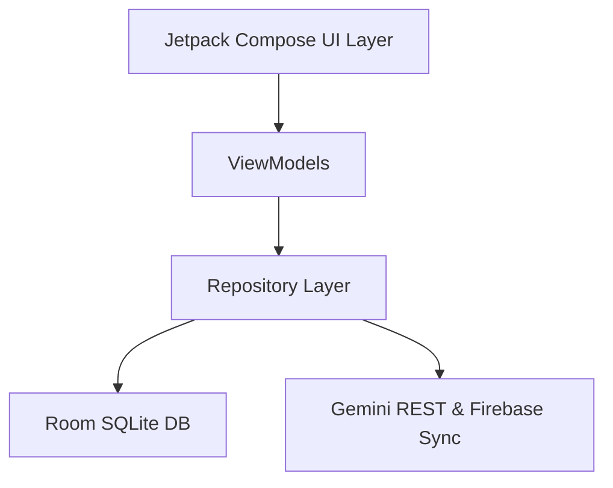

# 📝 AI Notes Generator (AInotes)

A premium, high-fidelity Android application built with **Jetpack Compose**, **Kotlin**, **Room Database**, **Firebase Setup**, and an advanced **Gemini REST Fallback Chain** to seamlessly generate, sync, and organize study materials (Key Notes, Formulae, Flashcards, and Exam Prep) from uploaded documents, PDFs, and images.

---

## 🎨 UI & UX Design System (Visual Previews)

The application has been designed from the ground up to follow **modern mobile aesthetics** featuring a beautiful **violet/indigo theme**, smooth canvas animations, glowing gradients, and responsive layouts.

### 🌟 Features At a Glance

*   **Get Started Onboarding:** Custom 3D Canvas-drawn notebook illustrations, floating interactive particles, and smart first-launch detection using `SharedPreferences`.
*   **Time-Aware Dashboard:** Personal greetings (e.g. *"Good afternoon, Anurag! 👋"*), custom initial-based user avatars, and real-time vertical lists showing only **today's chats**.
*   **Visual File Upload Panel:** High-fidelity upload card with glowing state indicators that turn green with a checkmark when a file is successfully loaded.
*   **Interactive Orbit Loader:** Beautiful loading screen featuring a floating robot, canvas-drawn gradient rotating orbits, and smooth progress tracking.
*   **Tabbed Study Results:** 
    *   *Key Points:* Expandable cards with emoji-rich summaries.
    *   *Formulae:* A gorgeous, textbook-style chemistry formula block with custom borders.
    *   *Flashcards:* Clean, interactive flashcards with a smooth 3D flipping animation.
    *   *Exam Prep:* Curated mock questions and model answers.
*   **Persistent My Notes Library:** Fully synchronized archive of your bookmarked study sets, featuring quick searches, horizontal category pills, and real-time DB updates.

---

## 🛠️ Technology Stack & Architecture

This project is built using modern Android development best practices and **Clean Architecture**:



*   **UI Framework:** Jetpack Compose (Declarative UI)
*   **Language:** Kotlin (100% Coroutines & Flow)
*   **Architecture:** MVVM (Model-View-ViewModel) + Clean Repository Pattern
*   **Dependency Injection:** Dagger Hilt (`@HiltAndroidApp`, `@Inject`)
*   **Local Storage:** Room Database (SQLite) with custom Converters
*   **Remote Sync & Auth:** Firebase Authentication + Google Cloud Firestore
*   **AI Integration:** REST-based direct connection to Gemini APIs (bypasses buggy gRPC SDK serializers)
*   **OCR & PDF Parsing:** Custom `OcrHelper` and `PdfChunker`

---

## 🤖 Advanced Multi-Model Fallback Chain

To guarantee **99.9% uptime** and prevent API quota limits or model unavailability from breaking the user experience, the app implements a robust **12-Model Fail-Safe Fallback Pipeline**. If a generation fails or times out, the engine automatically falls back to the next model in the chain within milliseconds:

1.  `gemini-3.5-flash` *(Default)*
2.  `gemini-3.1-flash-lite`
3.  `gemini-2.5-flash`
4.  `gemini-2.5-pro`
5.  `gemini-2.5-flash-lite`
6.  `gemini-2.0-flash`
7.  `gemini-2.0-flash-lite`
8.  `gemini-flash-latest`
9.  `gemini-pro-latest`
10. `gemini-3-flash-preview`
11. `gemini-3-pro-preview`
12. `gemini-3.1-pro-preview`

---

## 📁 Repository Structure

```
├── app
│   ├── src
│   │   ├── main
│   │   │   ├── java/com/ainotes
│   │   │   │   ├── data
│   │   │   │   │   ├── local        # Room DB, AppDatabase, UserPreferences
│   │   │   │   │   ├── model        # NoteSession, StudyNotes, UserProfile
│   │   │   │   │   └── repository   # GeminiRepository, FirebaseSyncRepository
│   │   │   │   ├── service          # DocumentProcessingService
│   │   │   │   ├── ui
│   │   │   │   │   ├── screens      # Home, History, Results, SplashScreen, Profile Setup
│   │   │   │   │   └── theme        # Color.kt, Scheme.kt, Type.kt
│   │   │   │   └── util             # PdfChunker, OcrHelper, FileHelper
│   │   │   └── AndroidManifest.xml
│   │   └── build.gradle.kts
│   ├── google-services.json         # Firebase Configuration
│   └── local.properties             # API Keys & Local SDK Paths
└── build.gradle.kts
```

---

## ⚡ Setup & Installation

Follow these steps to run the project locally on Android Studio:

### 1. Prerequisites
*   Android Studio Jellyfish (or newer)
*   JDK 17 or higher
*   Android SDK 34 (API level 34)

### 2. Clone the Repository
```bash
git clone https://github.com/YOUR_USERNAME/AInotes.git
cd AInotes
```

### 3. Add API Keys
Create or open the `local.properties` file in the root directory and add your Gemini API Key:
```properties
sdk.dir=YOUR_ANDROID_SDK_PATH
GEMINI_API_KEY=your_gemini_api_key_here
```

### 4. Connect Firebase
1.  Create a project on the [Firebase Console](https://console.firebase.google.com/).
2.  Enable **Email/Password Authentication** and **Cloud Firestore**.
3.  Register a new Android App with package name `com.ainotes`.
4.  Download the `google-services.json` file and place it in the `app/` directory.

### 5. Build and Run
To compile and generate the debug APK from the command line:
```bash
# Windows
.\gradlew.bat assembleDebug

# macOS / Linux
./gradlew assembleDebug
```
The compiled APK will be located at `app/build/outputs/apk/debug/app-debug.apk`.

---

## 🔐 Database Schema (Room)

The local SQLite database tracks session data and bookmark states:

### `note_sessions` Table
| Column | Type | Description |
| :--- | :--- | :--- |
| `id` | `String` (PK) | Unique Session UUID |
| `title` | `String` | Topic Title |
| `createdAt` | `Long` | Timestamp of Generation |
| `isSaved` | `Boolean` | Star / Saved status (Persisted locally) |
| `studyNotes` | `String` (JSON) | Custom serialized StudyNotes object (Type Converters) |

---

## 🤝 Contribution Guidelines
Contributions are welcome! Please feel free to open a Pull Request or report an issue. 

1.  Fork the Project.
2.  Create your Feature Branch (`git checkout -b feature/AmazingFeature`).
3.  Commit your Changes (`git commit -m 'Add some AmazingFeature'`).
4.  Push to the Branch (`git push origin feature/AmazingFeature`).
5.  Open a Pull Request.

---

*Made with 💜 and AI by Anurag*
